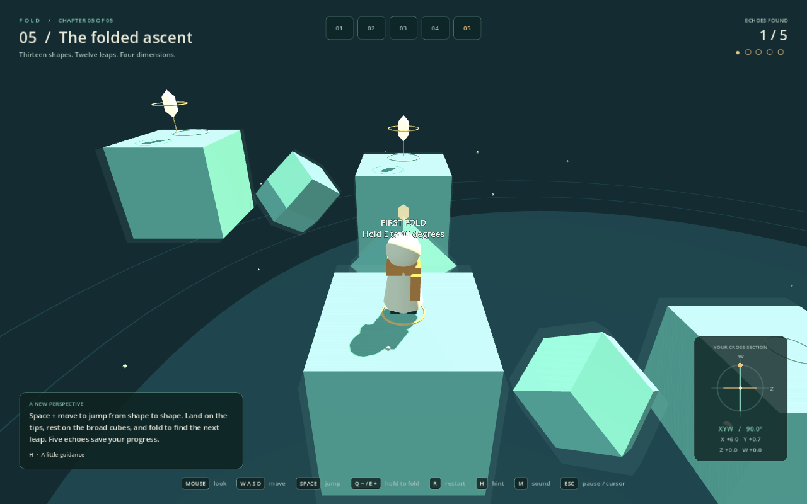

# FOLD — The Quiet Dimension

A playable, original four-dimensional puzzle platformer made in Godot. Explore four floating gardens, collect their echoes, and find the amber gate. Folding continuously rotates the view through Z and W, exposing paths that lie outside your current three-dimensional slice.

Inspired by the spatial navigation described by [Miegakure](https://miegakure.com/). FOLD has its own levels, visuals, character, and synthesized audio.



## Play

On this Windows workspace, double-click **PLAY.cmd**. A portable Godot 4.6 engine is already available in `.tools/godot`.

Choose **Explore the labyrinth** on the title screen to jump straight into the new maze, or press **Escape → 04** during play. The fourth chapter has two connected maze layers, five named echoes, checkpoint respawns, and a raised sky walk to the gate. Follow the teal landmark rings and use **H** if you need a direction.

Alternatively, import **project.godot** into Godot 4.6 or newer and press **F5**. The project uses the Compatibility renderer and has no external asset dependencies. The included FOLD Levels add-on provides visual level authoring.

| Input | Action |
| --- | --- |
| Mouse | Look around the traveler |
| WASD / arrow keys | Move relative to the camera |
| Space | Jump |
| Hold Q / E | Rotate the slice in opposite directions (Q decreases the angle, E increases it) |
| H | Show the next hint |
| R | Restart the current garden |
| Escape | Pause and free the cursor / resume mouse look |
| M | Mute / unmute |
| Enter | Start / continue after completion |
| 01 / 02 / 03 / 04 buttons in the pause menu | Choose a garden |

Fold while standing on a surface. Hold Q or E to rotate at 90° per second, and release to keep any slice angle. Rotation continues through a full circle. Find every echo in the garden, then enter its gate. Falling returns you to the start or your latest checkpoint and preserves collected echoes; restarting clears the garden. The orientation panel shows your slice angle, identifies mixed Z/W views, and displays your coordinates. Press H for route guidance.

The third-person camera follows the traveler, and the mouse controls its direction and pitch. WASD and arrow keys stay relative to the camera as you look around: W moves into the view, S moves toward the camera, and A/D move left/right across the view. The traveler faces the direction of movement, while the camera moves closer when walls or solid edges obstruct the view. Starting or resuming captures the cursor for mouse look; Escape pauses and frees it for the menu. Restarting or respawning resets the camera behind the traveler, facing toward the gate.

## Gardens

1. **A direction unseen:** walk around a wall's edge in W.
2. **The missing span:** discover a bridge outside the starting slice.
3. **Two turns from home:** preserve hidden coordinates, use both depth axes, and climb the final steps.
4. **The fourfold labyrinth:** explore 18 rooms across Z and W, discover loops and five echoes, then climb to a hidden sky walk and the elevated gate. Each echo saves a checkpoint; collected echoes leave a small amber ring. Hints follow the earliest missing echo and can be cycled with H.

The first three gardens introduce the mechanics; the fourth combines them into a longer maze. Progress is kept for the current session. In the labyrinth, falling returns to the latest echo checkpoint; R resets the entire chapter. Spoiler walkthroughs and geometry notes are in [docs/LEVELS.md](docs/LEVELS.md).

## How the fourth dimension works

Every solid, echo, and player position lives in `(x, y, z, w)`. Y is height. X is always available. At 0°, depth movement changes Z and preserves W; at 90°, it changes W and preserves Z. Intermediate views move through a blend of Z and W, following the displayed slice. W is a spatial coordinate, not time or a separate level.

The renderer intersects each 4D solid with a 3D hyperplane passing through the player. Boxes and the solid edge beams of regular 4D shapes have exact cross-sections at every Z–W fold angle. Collision remains in 4D, so changing the view never teleports through a solid. Walking pauses while you rotate the slice, and folding requires ground contact. Releasing Q/E stops immediately without snapping to an axis.

The prototype supports one rotation plane, axis-aligned 4D boxes, scalable regular 4D edge frames, and a finite 4D player collision box. The 5-cell, tesseract, 16-cell, 24-cell, 120-cell, and 600-cell have solid edges with open faces and interiors that the player can move through. Faint silhouettes mark nearby solids touching the traveler's thickness just outside the visible slice. Trees are decorative cross-sections and have no collision. This is a focused implementation of the slice-navigation mechanic, not a general 4D physics engine.

## Create a level

Double-click **EDIT_LEVELS.cmd**, or open the project in Godot and select the **FOLD Levels** workspace at the top of the editor. The bundled plugin is enabled in the project settings.

Start with **New**, add platforms and echoes, and drag them on the X/Z or X/W grid. Edit height and all four dimensions in the object controls. Set the start and gate, then use **Playtest** to try the garden in the actual game. Save your creation as a `.tres` file under `levels/custom/`; no scripting is required. See [the level editor guide](docs/LEVEL_EDITOR.md) for controls and geometry tips.

Use **4D EDGE FRAMES → + 4D Shape** to add a **5-cell, tesseract, 16-cell, 24-cell, 120-cell, or 600-cell**. Each has editable X/Y/Z/W position, uniform **Scale**, and independent **Edge thickness**. Scale is the distance from the center to each vertex in world units; increase it to make more room between the solid beams.

Open **4D Samples** in the editor to try one simple level per shape. Each includes a broad floor, two echoes, hints, and a walking route through the open frame with a short W detour. Use **Save As** to adapt a sample. The [shape sample guide](docs/SHAPE_SAMPLES.md) lists the files and explains what a slice shows; these six showcases are separate from the original campaign.

## Project structure

- `scenes/main.tscn` and `scripts/main.gd`: compose the game systems; coordinate 4D movement, collision, and session state.
- `game/world_view.tscn` and `game/world_view.gd`: own environment, traveler, level geometry, and slice rendering.
- `levels/`: typed `FoldLevel` / `FoldBox` / `FoldShape` resources and four campaign gardens as editable `.tres` files; `levels/samples/` contains six shape showcases.
- `scripts/level_data.gd`: explicit campaign catalog; returns independent runtime snapshots.
- `scripts/slice_geometry.gd`: pure slab intersection and collision calculations.
- `scripts/polytope_geometry.gd` and `scripts/edge_geometry.gd`: regular 4D topology, solid edge beams, exact edge collision, and sliced edge meshes.
- `scripts/game_hud.gd` and `scripts/soundscape.gd`: UI signals and audio, wired by the main scene controller.
- `addons/fold_level_editor/`: visual authoring workspace, document history, and projection canvas.
- `assets/stone.gdshader`: tiled stone and garden surface material.
- `tests/`: geometry, gameplay, input, resource, and editor regression checks.

The structure follows Godot's guidance on [scene organization](https://docs.godotengine.org/en/stable/tutorials/best_practices/scene_organization.html), [resources for data](https://docs.godotengine.org/en/stable/tutorials/best_practices/node_alternatives.html), and [project organization](https://docs.godotengine.org/en/stable/tutorials/best_practices/project_organization.html). World, HUD, and audio have separate lifetimes within a composed scene; the controller supplies the world with data and connects UI signals. Level resources hold authoring data, while runtime dictionaries are isolated snapshots. Input actions live in Project Settings, and documentation/generated captures are excluded from asset import with `.gdignore`.

Run tests from the project directory (replace the executable with your Godot path on other machines):

```powershell
& '.tools/godot/Godot_v4.6-stable_win64_console.exe' --headless --path . --script tests/test_slice_geometry.gd
& '.tools/godot/Godot_v4.6-stable_win64_console.exe' --headless --path . --script tests/test_playthrough.gd
& '.tools/godot/Godot_v4.6-stable_win64_console.exe' --headless --path . --script tests/test_maze_features.gd
& '.tools/godot/Godot_v4.6-stable_win64_console.exe' --headless --path . --script tests/test_interactions.gd
& '.tools/godot/Godot_v4.6-stable_win64_console.exe' --headless --path . --script tests/test_camera.gd
& '.tools/godot/Godot_v4.6-stable_win64_console.exe' --headless --path . --script tests/test_level_resources.gd
& '.tools/godot/Godot_v4.6-stable_win64_console.exe' --headless --path . --script tests/test_custom_levels.gd
& '.tools/godot/Godot_v4.6-stable_win64_console.exe' --headless --path . --script tests/test_polytope_geometry.gd
& '.tools/godot/Godot_v4.6-stable_win64_console.exe' --headless --path . --script tests/test_edge_geometry.gd
& '.tools/godot/Godot_v4.6-stable_win64_console.exe' --headless --path . --script tests/test_shape_samples.gd
& '.tools/godot/Godot_v4.6-stable_win64_console.exe' --headless --path . --script tests/test_level_editor.gd
& '.tools/godot/Godot_v4.6-stable_win64_console.exe' --headless --path . --script tests/test_editor_ui.gd
```

To produce a rendered screenshot in `test-output`, run with `-- --capture` or `-- --capture-title`. Add `--level2`, `--level3`, `--level4`, or `--folded` after the separator to inspect other views. Run `--script tests/maze_preview.gd` without `--headless` to capture the labyrinth entrance, fold court, sky walk, and menus.

Run `--script tests/editor_preview.gd` without `--headless` to capture the editor panel at desktop and compact sizes. Add `-- --playtest` to the `test_editor_ui.gd` command to also launch and stop a real game window. Import the project once in the editor before running scripts on a fresh checkout so Godot registers the named resource classes.

Run `--script tests/shape_preview.gd` without `--headless` to capture all six samples and the 120-cell during folding. When running tests in a restricted environment, add `--log-file C:/MyProjects/Fold/test-output/test.log` if Godot cannot write its default user log.

To run a saved custom garden directly, append `-- --level=res://levels/custom/my_garden.tres`. For a persistent F5 override, assign a `FoldLevel` resource to the main scene's **Level Override** property in the Inspector. The campaign list is explicit in `scripts/level_data.gd`, so saving a draft never silently adds it to the campaign.
