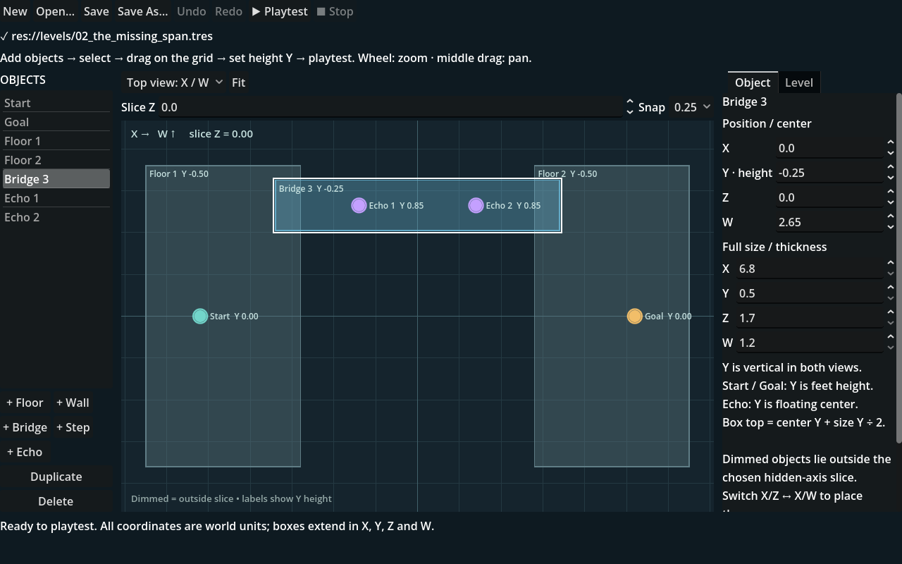

# FOLD level editor

Open `project.godot` in Godot 4.6 or newer, or double-click `EDIT_LEVELS.cmd` on Windows. Select **FOLD Levels** in the editor's top workspace bar. If it is absent, enable **FOLD Levels** under **Project → Project Settings → Plugins**.



## First garden

1. Choose **New** to start with a platform, a start, an echo, and a gate.
2. Select an object in the list or on a grid. Drag it to move it with grid snapping. Use the numeric controls for precise placement and height.
3. Add floors, walls, bridges, steps, or echoes. Duplicate repeated pieces and delete unwanted pieces. Start and goal are permanent markers that you can reposition.
4. Check both **X/Z** and **X/W** projections. A path can exist along one depth axis while a wall blocks the other.
5. Set the title, subtitle, lesson, and hints. Hints are optional; they appear when a player presses H.
6. Use **Playtest** to run the current draft in the actual game. Walk the route, collect every echo, fold along both axes, and reach the gate.
7. Choose **Save As** and save a `.tres` file under `res://levels/custom/`. **Open** loads an existing resource. Use **Save As** when adapting a campaign garden into a new level.

Undo and redo restore edits to geometry and text. Switching to New or Open prompts before discarding unsaved changes. Playtesting writes a separate temporary resource under `user://`; it does not overwrite the level being authored.

Use **Stop** to close a playtest window. Edits are also preserved in a local recovery draft; **Restore draft** appears when a previous session left one. Saving or deliberately opening a new document clears the old recovery file. Geometry edits clear recorded solution routes, and undo restores them together with the geometry.

## Think in four coordinates

| Coordinate | Meaning |
| --- | --- |
| X | Left/right in both projections |
| Y | Height; edit numerically |
| Z | Depth before folding |
| W | Depth after folding |

The grids are top-down projections. The slice controls help inspect geometry at the hidden coordinate; also verify height in the numeric controls and by playtesting. Two platforms that overlap on the grid can still be separated in Y or the hidden axis.

Each box uses a **center** and full **size** along all four axes. Its top is `center.y + size.y / 2`. A floor centered at Y `-0.5` with size Y `1` therefore has top Y `0`. Start and goal positions use the player's feet. Echo positions use floating centers, usually `0.85` above the walking surface.

The traveler has radius `0.27` along X, Z, and W and height `1.25`. Leave clearance in all four coordinates. Jump height is about `1.44`; a level-ground jump covers about `3.36` units. The existing stairs rise `0.8` per step. Falling below Y `-7` returns the player to the start.

## A simple folding puzzle

Keep the starter floor and place a wall at `(0, 1.5, 0, 0)` with size `(0.5, 3, 10, 1)`. Its Z extent blocks the visible route, but its W extent is narrow. Place an echo at `(1, 0.85, 0, 2)` and the gate at `(4, 0, 0, 0)`. Test walking toward the wall, folding, moving to W `2`, passing the wall, and returning to W `0` on the far side.

Validation catches missing titles, missing floors/solids, invalid sizes, and non-finite coordinates. Warnings flag unsupported or obstructed start/goal positions. These checks do not prove solvability: playtest every garden, particularly stairs, bridges, and folds beside walls.

## Use a saved garden

The editor's **Playtest** button runs the current draft. For F5 play, select the root of `scenes/main.tscn` and assign the saved resource to **Level Override** in the Inspector. Leave this property empty to run the original campaign.

Alternatively, run:

```powershell
& '.tools/godot/Godot_v4.6-stable_win64_console.exe' --path . -- --level=res://levels/custom/my_garden.tres
```

To deliberately include a finished garden in the campaign, add its resource path to `CAMPAIGN_PATHS` in `scripts/level_data.gd`. Drafts do not join the campaign automatically. The optional `solution` and `jump_segments` fields are for deterministic regression routes; they are not required for normal play.
